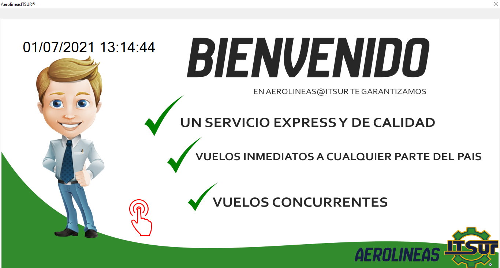

# Sistema simulador de venta de boletos de asiento de una empresa avionera.

<h2>aereolineasITSUR es un pequeño sistema de control y venta de boletos de asiento para una agencia avionera, realizado en C# y con lectura de archivos (no DB).</h2>

Realizado en Junio-2017

#Pantalla de bienvenida.

