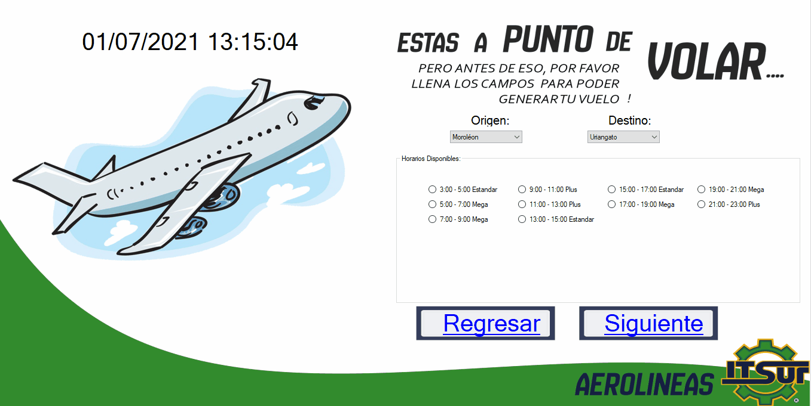

# Sistema simulador de venta de boletos de asiento de una empresa avionera.

<h2>aereolineasITSUR es un pequeño sistema de control y venta de boletos de asiento para una agencia avionera, realizado en C# y con lectura de archivos (no DB).</h2>

Realizado en Junio-2017

<strong>Pantalla de bienvenida (Tocar o clic en la pantalla).</strong>
 

<strong>Ventana de seleccion del vuelo, hora y tipo.</strong>
En esta ventana se realiza la seleccion del horario y el tipo de vuelo (Estandar, Mega o Plus). Segun la seleccion del usuario y seguido muestra los asientos disponibles con la posibilidad de seleccionar el que desee, ademas se calcula un total por los asientos seleccionados. 
-Ejemplo vuelo asiento estandar.
 
-Ejemplo vuelo asiento mega. 
 
-Ejemplo vuelo asiento plus. 
 

